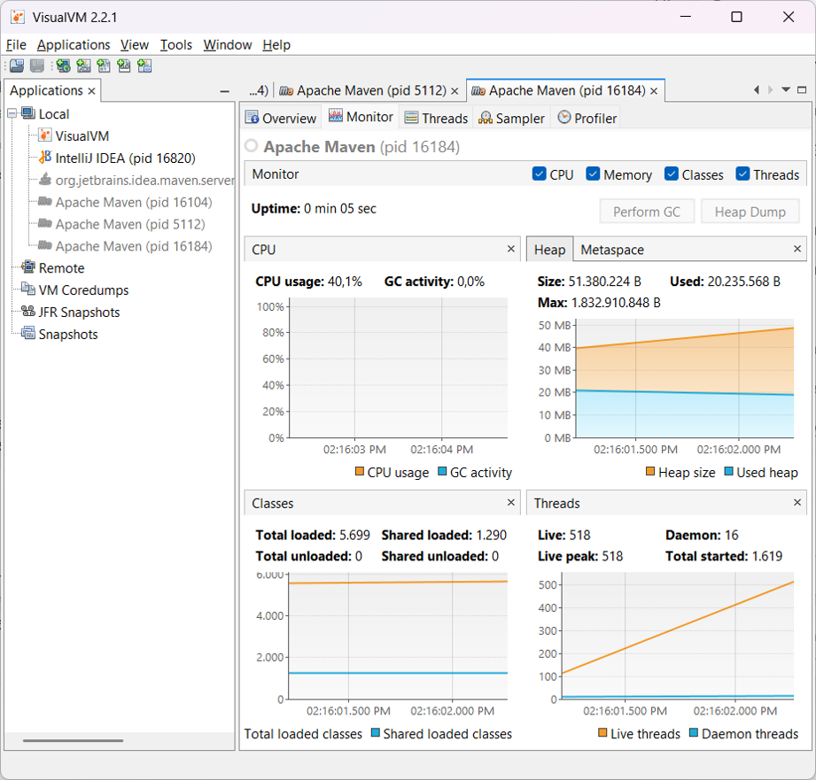
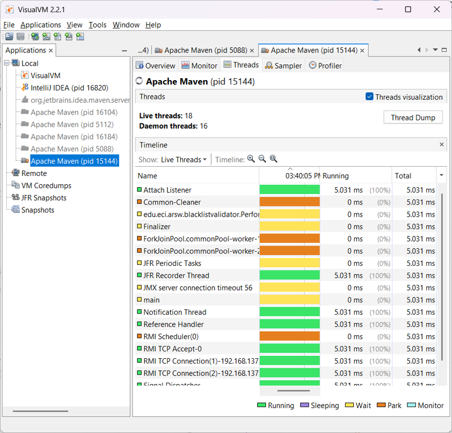
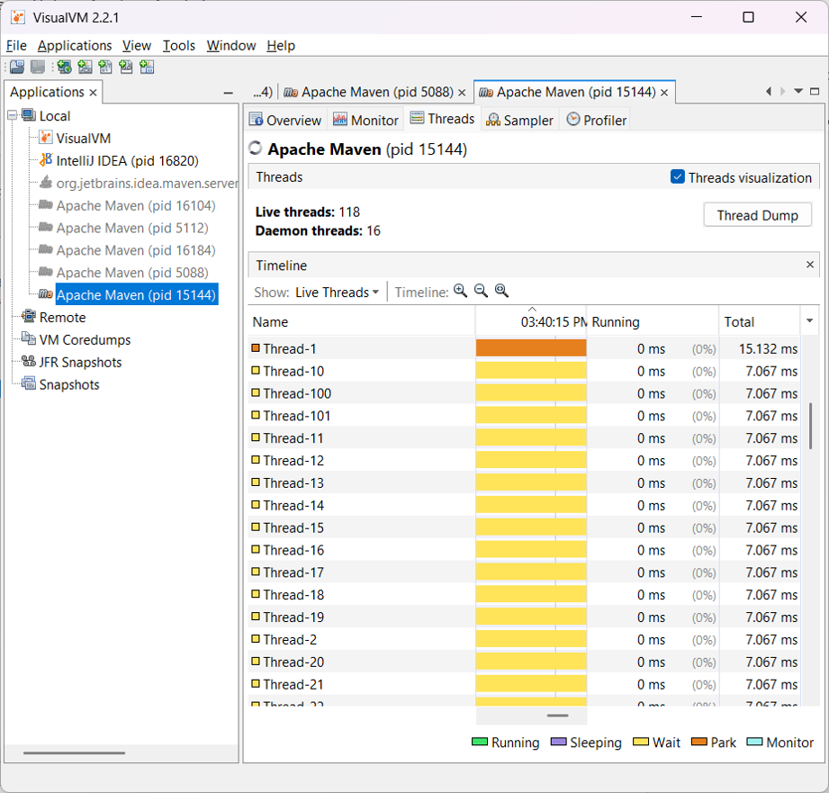
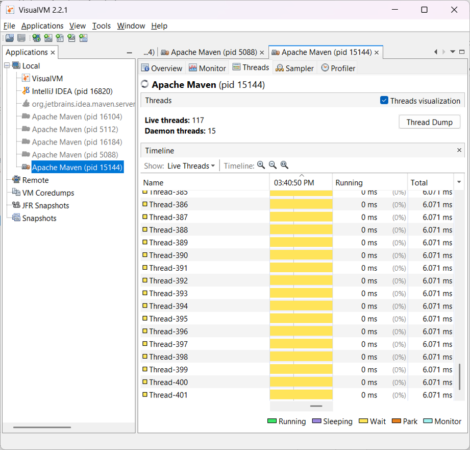

### Escuela Colombiana de Ingeniería
### Arquitecturas de Software - ARSW
## Ejercicio Introducción al paralelismo - Hilos - Caso BlackListSearch

### Dependencias:
####   Lecturas:
*  [Threads in Java](http://beginnersbook.com/2013/03/java-threads/)  (Hasta 'Ending Threads')
*  [Threads vs Processes]( http://cs-fundamentals.com/tech-interview/java/differences-between-thread-and-process-in-java.php)

### Descripción
  Este ejercicio contiene una introducción a la programación con hilos en Java, además de la aplicación a un caso concreto.
  

**Parte I - Introducción a Hilos en Java**

1. De acuerdo con lo revisado en las lecturas, complete las clases CountThread, para que las mismas definan el ciclo de vida de un hilo que imprima por pantalla los números entre A y B.
   2. Complete el método __main__ de la clase CountMainThreads para que:
       1. Cree 3 hilos de tipo CountThread, asignándole al primero el intervalo [0..99], al segundo [99..199], y al tercero [200..299].
       2. Inicie los tres hilos con 'start()'.
       3. Ejecute y revise la salida por pantalla. 
       4. Cambie el inicio con 'start()' por 'run()'. Cómo cambia la salida?, por qué?.

          Con `start()` los tres hilos arrancan al mismo tiempo y cada uno corre por su cuenta, por eso los números salen mezclados en la consola (ves el 0, luego el 99, luego el 200, sin un orden fijo). Eso es lo que se busca cuando se usan hilos: que trabajen todos a la vez.

          Con `run()` en cambio no se crea ningún hilo nuevo. Es como llamar a un método normal, así que el programa espera a que el primero termine para arrancar el segundo, y así. Por eso los números salen ordenados del 0 al 299, pero uno tras otro, sin que nada corra al mismo tiempo.

          En resumen: `start()` los lanza a todos a la vez y la salida sale mezclada. `run()` los ejecuta uno por uno y la salida sale ordenada.

**Parte II - Ejercicio Black List Search**

Para un software de vigilancia automática de seguridad informática se está desarrollando un componente encargado de validar las direcciones IP en varios miles de listas negras (de host maliciosos) conocidas, y reportar aquellas que existan en al menos cinco de dichas listas. 

Dicho componente está diseñado de acuerdo con el siguiente diagrama, donde:

- HostBlackListsDataSourceFacade es una clase que ofrece una 'fachada' para realizar consultas en cualquiera de las N listas negras registradas (método 'isInBlacklistServer'), y que permite también hacer un reporte a una base de datos local de cuando una dirección IP se considera peligrosa. Esta clase NO ES MODIFICABLE, pero se sabe que es 'Thread-Safe'.

- HostBlackListsValidator es una clase que ofrece el método 'checkHost', el cual, a través de la clase 'HostBlackListDataSourceFacade', valida en cada una de las listas negras un host determinado. En dicho método está considerada la política de que al encontrarse un HOST en al menos cinco listas negras, el mismo será registrado como 'no confiable', o como 'confiable' en caso contrario. Adicionalmente, retornará la lista de los números de las 'listas negras' en donde se encontró registrado el HOST.

Al usarse el módulo, la evidencia de que se hizo el registro como 'confiable' o 'no confiable' se dá por lo mensajes de LOGs:

INFO: HOST 205.24.34.55 Reported as trustworthy

INFO: HOST 205.24.34.55 Reported as NOT trustworthy

Al programa de prueba provisto (Main), le toma sólo algunos segundos análizar y reportar la dirección provista (200.24.34.55), ya que la misma está registrada más de cinco veces en los primeros servidores, por lo que no requiere recorrerlos todos. Sin embargo, hacer la búsqueda en casos donde NO hay reportes, o donde los mismos están dispersos en las miles de listas negras, toma bastante tiempo.

Éste, como cualquier método de búsqueda, puede verse como un problema [vergonzosamente paralelo](https://en.wikipedia.org/wiki/Embarrassingly_parallel), ya que no existen dependencias entre una partición del problema y otra.

Para 'refactorizar' este código, y hacer que explote la capacidad multi-núcleo de la CPU del equipo, realice lo siguiente:

1. Cree una clase de tipo Thread que represente el ciclo de vida de un hilo que haga la búsqueda de un segmento del conjunto de servidores disponibles. Agregue a dicha clase un método que permita 'preguntarle' a las instancias del mismo (los hilos) cuantas ocurrencias de servidores maliciosos ha encontrado o encontró.

2. Agregue al método 'checkHost' un parámetro entero N, correspondiente al número de hilos entre los que se va a realizar la búsqueda (recuerde tener en cuenta si N es par o impar!). Modifique el código de este método para que divida el espacio de búsqueda entre las N partes indicadas, y paralelice la búsqueda a través de N hilos. Haga que dicha función espere hasta que los N hilos terminen de resolver su respectivo sub-problema, agregue las ocurrencias encontradas por cada hilo a la lista que retorna el método, y entonces calcule (sumando el total de ocurrencuas encontradas por cada hilo) si el número de ocurrencias es mayor o igual a _BLACK_LIST_ALARM_COUNT_. Si se da este caso, al final se DEBE reportar el host como confiable o no confiable, y mostrar el listado con los números de las listas negras respectivas. Para lograr este comportamiento de 'espera' revise el método [join](https://docs.oracle.com/javase/tutorial/essential/concurrency/join.html) del API de concurrencia de Java. Tenga también en cuenta:

	* Dentro del método checkHost Se debe mantener el LOG que informa, antes de retornar el resultado, el número de listas negras revisadas VS. el número de listas negras total (línea 60). Se debe garantizar que dicha información sea verídica bajo el nuevo esquema de procesamiento en paralelo planteado.

	* Se sabe que el HOST 202.24.34.55 está reportado en listas negras de una forma más dispersa, y que el host 212.24.24.55 NO está en ninguna lista negra.

**Parte II.I Para discutir la próxima clase (NO para implementar aún)**

La estrategia de paralelismo antes implementada es ineficiente en ciertos casos, pues la búsqueda se sigue realizando aún cuando los N hilos (en su conjunto) ya hayan encontrado el número mínimo de ocurrencias requeridas para reportar al servidor como malicioso. Cómo se podría modificar la implementación para minimizar el número de consultas en estos casos?, qué elemento nuevo traería esto al problema?
    
* Nosotros implementaríamos un contador global entre los hilos para poder determinar el momento en el que se llega al BLACK_LIST_ALARM_COUNT.
* El elemento nuevo acaba con el concepto de "vergonzosamente paralelo" ya que ahora si hay una dependencia entre los hilos lo que trae un nuevo problema y por otro lado igualmente se pueden llegar a identificar mas de 5 ocurrencias si se llegan a reportar dos o mas simultaneamente.

**Parte III - Evaluación de Desempeño**

A partir de lo anterior, implemente la siguiente secuencia de experimentos para realizar las validación de direcciones IP dispersas (por ejemplo 202.24.34.55), tomando los tiempos de ejecución de los mismos (asegúrese de hacerlos en la misma máquina):

1. Un solo hilo.
2. Tantos hilos como núcleos de procesamiento (haga que el programa determine esto haciendo uso del [API Runtime](https://docs.oracle.com/javase/7/docs/api/java/lang/Runtime.html)).
3. Tantos hilos como el doble de núcleos de procesamiento.
4. 50 hilos.
5. 100 hilos.

Al iniciar el programa ejecute el monitor jVisualVM, y a medida que corran las pruebas, revise y anote el consumo de CPU y de memoria en cada caso. 

Con lo anterior, y con los tiempos de ejecución dados, haga una gráfica de tiempo de solución vs. número de hilos. Analice y plantee hipótesis con su compañero para las siguientes preguntas (puede tener en cuenta lo reportado por jVisualVM):

**Parte IV - Ejercicio Black List Search**

1. Según la [ley de Amdahls](https://www.pugetsystems.com/labs/articles/Estimating-CPU-Performance-using-Amdahls-Law-619/#WhatisAmdahlsLaw?):

	, donde _S(n)_ es el mejoramiento teórico del desempeño, _P_ la fracción paralelizable del algoritmo, y _n_ el número de hilos, a mayor _n_, mayor debería ser dicha mejora. Por qué el mejor desempeño no se logra con los 500 hilos?, cómo se compara este desempeño cuando se usan 200?. 
    En nuestro caso el mejor rendimiento se logró con 500 hilos (331 ms). Esto se dió porque la Ley de Amdahl "piensa" en el número de procesadores dando por hecho que los hilos están "compitiendo" por la CPU. En nuestro caso despues de 1 ms cada consulta queda en estado sleep, en donde claramente un hilo en estado sleep no consume de la CPU.
    Luego, en efecto si hay un empeoramiento en el rendimiento con los siguientes números 407 ms con 1.000 hilos, 415 ms con 2.000 y 756 ms con 5.000.
    En conclusión, llega un punto en que crear y administrar los hilos cuesta más que el trabajo que van a hacer.

2. Cómo se comporta la solución usando tantos hilos de procesamiento como núcleos comparado con el resultado de usar el doble de éste?.

   Con 16 hilos tardó 7.831 ms y con 32 tardó 3.952 ms. Se demoró exactamente la mitad.
   Eso no debería pasar si el trabajo fuera de CPU: con 16 núcleos, pasar a 32 hilos no debería mejorar casi nada. Mejoró porque, otra vez, los hilos están dormidos. Cuando uno se duerme deja el núcleo libre y otro entra a usarlo. Nunca se estorban. El costo de cada consulta fue 1,57 ms con 16 hilos y 1,58 ms con 32. Igualito. Si se estuvieran peleando el procesador, ese número habría subido.

3. De acuerdo con lo anterior, si para este problema en lugar de 100 hilos en una sola CPU se pudiera usar 1 hilo en cada una de 100 máquinas hipotéticas, la ley de Amdahls se aplicaría mejor?. Si en lugar de esto se usaran c hilos en 100/c máquinas distribuidas (siendo c es el número de núcleos de dichas máquinas), se mejoraría?. Explique su respuesta.
   Con 1 hilo en cada una de 100 máquinas sí se cumpliría mejor la teoría, porque ahí sí habría 100 procesadores de verdad y no 100 hilos repartiéndose 16 núcleos.
   Con varios hilos en menos máquinas sí mejoraría, ya que repartir trabajo entre hilos de la misma máquina es barato, porque comparten memoria y no hay red de por medio. Repartirlo entre máquinas es caro. Entonces conviene exprimir cada máquina al máximo y usar las menos máquinas posibles.

**Evidencias de trabajo**

Estado base antes de la carga (18 hilos): Proceso Apache Maven (pid 15144) durante el periodo de espera previo a la carga. La JVM tiene 18 hilos vivos.

Inicio de la carga con 100 hilos (03:40:15): El conteo sube a 118 hilos vivos: los 100 hilos BlackListThread creados por checkHost más los 18 de infraestructura. La numeración va de Thread-1 a Thread-101, correspondiente a la primera vuelta de búsqueda. La columna Running marca 0 ms (0%) en todas las filas.

Misma corrida 20 segundos después. El conteo de hilos vivos se mantiene en 118, pero la numeración ya va por Thread-254 a Thread-270. Cada vuelta de búsqueda crea 100 hilos nuevos y los descarta al terminar, en lugar de reutilizarlos.

La numeración alcanza Thread-385 a Thread-401 manteniendo los mismos ~118 hilos vivos. En 35 segundos se crearon y destruyeron cerca de 400 hilos. Este costo de creación y destrucción es el que domina el tiempo de ejecución en las configuraciones de miles de hilos (analizado Parte IV).

